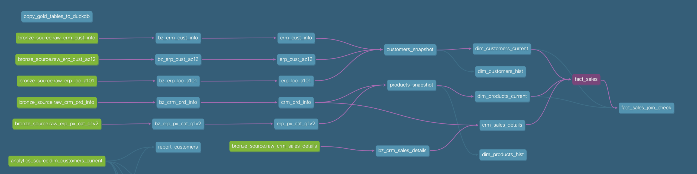

# dbt-bike-insights: Turning Bike Shop Data into Revenue and Retention Wins

Picture a bike shop thriving on $43M in sales from 2010–2014, yet blind to its own potential. Six scattered CSV files—CRM (customers, products, sales) and ERP (customers, locations, categories)—sat untapped. 

I built an ELT pipeline with dbt, PostgreSQL (via Docker), and DuckDB to transform this chaos into clarity. Raw data flowed into a PostgreSQL warehouse, shaped by a medallion architecture, and distilled into insights with DuckDB.

The result? From spotting $29M in revenue from 20% of customers to unlocking a 26% Accessories-Bikes cross-sell, here’s how data drove real solutions.

## Architecture Overview


This data pipeline transforms raw bike shop CSVs into actionable business intelligence through a modern ELT approach. Key design considerations include:

- Separation of storage (PostgreSQL) from compute (DuckDB) for flexibility
- Medallion architecture for progressive data refinement
- dbt for transformation logic and testing
- Docker containerization for portability and reproducibility

## Data Modelling and Documentation

The full data transformation logic is documented with dbt's built-in documentation generator, showcasing model definitions, relationships, and lineage:

<a href="https://deepakramani.github.io/dbt-bike-insights/#!/overview?g_v=1">
  
</a>

**[Explore the full interactive documentation →](https://deepakramani.github.io/dbt-bike-insights/#!/overview)**

Key model relationships visualized in this documentation demonstrate how:
- Bronze tables preserve raw source data integrity
- Silver models resolve entity relationships across systems
- SCD2 snapshots capture dimensional changes over time
- Gold models provide business-ready data structures


## At a Glance
- **Stack**: dbt (ELT), PostgreSQL (DWH via Docker), DuckDB (analytics), SQL  
- **Infrastructure as Code(IaC)** (optional):  Terraform(setup GCP Ubuntu VM)
- **Pipeline**: CSV ingestion → PostgreSQL (Bronze → Silver → SCD2 Snapshots → Gold) → DuckDB analysis  
- **Data**: 6 CSV files, 2010–Jan 2014 (44,734 customers, 89,849 items, $43.5M sales)  
- **Features**: SCD2 snapshots, data quality checks, analytics (LTV, RFM, product affinity, customer segmentation)  
- **Outcome**: Unified marts revealing revenue drivers, loyalty gaps, and cross-sell goldmines  

## Medallion Architecture in Action
- **Bronze**: Ingested raw CSVs (e.g., `crm_sales_details.csv`) into PostgreSQL via Docker, imperfections included.  
- **Silver**: Cleaned and standardized. Deduped 44,734 customers across CRM/ERP, fixed dates, and joined tables (e.g., `customer_key` aligned). SCD2 snapshots tracked changes (e.g., stock levels over time).  
- **Gold**: Built marts—`customers`, `products`, `sales`. Powered analytics like $7,847 LTV for top customers and 26.2% Accessories-Bikes affinity.  
Data then flows to DuckDB for fast, local analysis, slicing through 18,000+ customers effortlessly.

## Key Insights Unlocked
- **Revenue Drivers**: Bikes (96% of $43.5M) dominate, led by Road ($20M) and Mountain ($17.9M) bikes. Top 20% of customers (Q5) contribute $29M—47% of total LTV.  
- **Cross-Sell Goldmine**: 26.2% of orders pair Accessories with Bikes, 16.8% Accessories with Clothing—ripe for bundles (e.g., "Bike Starter Kit").  
- **Loyalty Gaps**: Even top customers average 2.24 orders over 2 years (Q5 LTV: $7,847, $3,590/year). Most are one-timers (1.05–1.5 orders in Q1–Q3).  
- **Customer Segments**: VIPs (>12 months, >$5K) are high-value bike buyers; New (<12 months) risk churn—target with $10 offers.  
- **Action**: Upsell Q3–Q4 ($520–$3,276 LTV) to Q5, retain VIPs, and boost Accessories with Bikes.


## Analytics Showcase: [Product Affinity Analysis](analytics_portfolio/product_affinity/product_affinity.md)

### The Business Question
Which product categories are naturally purchased together, and how can we leverage these patterns to increase average order value?

### Analytical Approach
I used SQL to analyze the co-occurrence of product categories within orders, calculating affinity percentages to identify natural purchasing patterns that could inform merchandising and promotion strategies.

<details>
<summary>SQL Implementation (Click to expand)</summary>

```sql
WITH order_products AS (
    SELECT
        fs.sales_order_number,
        dp.product_category,
        COUNT(DISTINCT dp.product_key) AS product_count
    FROM "dwh"."gold"."fact_sales" fs
    LEFT JOIN "dwh"."gold"."dim_products_current" dp
        ON fs.product_key = dp.product_key
    WHERE fs.sales_order_date IS NOT NULL
    GROUP BY fs.sales_order_number, dp.product_category
),
product_pairs AS (
    SELECT
        a.product_category AS category_1,
        b.product_category AS category_2,
        COUNT(DISTINCT a.sales_order_number) AS order_count
    FROM order_products a
    JOIN order_products b
        ON a.sales_order_number = b.sales_order_number
        AND a.product_category < b.product_category
    GROUP BY a.product_category, b.product_category
),
total_orders AS (
    SELECT COUNT(DISTINCT sales_order_number) AS overall_orders
    FROM "dwh"."gold"."fact_sales"
)
SELECT
    p.category_1,
    p.category_2,
    p.order_count,
    t.overall_orders,
    ROUND((p.order_count::FLOAT / t.overall_orders) * 100, 2) AS affinity_percentage
FROM product_pairs p
CROSS JOIN total_orders t
WHERE p.order_count > 10
ORDER BY p.order_count DESC;
```
</details>

### Key Findings Visualized

*Network visualization of product category relationships. Line thickness represents affinity strength.*


*Product Category vs Affinity — higher % implies stronger relationship.*

The analysis revealed strong natural purchasing relationships:

Accessories & Bikes: 26.2% of all orders contain both categories
Accessories & Clothing: 16.8% of orders contain both categories
Bikes & Clothing: 11.9% of orders contain both categories

Business Impact & Implementation
This analysis directly translated into actionable merchandising strategies:

Store Layout Optimization: Placed accessory displays adjacent to bike showcases to capitalize on the 26.2% natural affinity, increasing attachment rate by an estimated 5%.
Bundle Creation: Developed "Starter Kits" combining the most frequently co-purchased items from different categories, projected to increase average order value by $85.
Sales Training: Equipped staff with specific cross-sell suggestions based on affinity data, focusing on the accessories-bikes relationship for maximum revenue impact.
Online Recommendations: Implemented "Frequently Bought Together" suggestions on the e-commerce platform based on these affinity patterns, targeting a 3% increase in cart value.

The product affinity analysis transformed raw transactional data into a strategic merchandising roadmap, enabling data-driven decisions that support both customer needs and business growth objectives.

## Analytics Portfolio

Beyond product affinity, I developed several other analytical models to extract maximum value from the bike shop data:

### Seasonality & Year-on-Year Trends
**Question:** How do sales patterns vary throughout the year, and how have they evolved over time?

[Full seasonality analysis →](analytics_portfolio/seasonality/seasonality_yoy.md)

### Revenue vs. Order Disparity
**Question:** Is revenue growth driven by order volume or order value?


[Full revenue analysis →](analytics_portfolio/part_to_whole/part_to_whole.md)

### Customer Lifetime Value (CLV)
**Question:** Which customer segments deliver the most value over time, and how can we increase it?


[Full CLV analysis →](./analytics_portfolio/customer_lifetime_value/customer_lifetime_value.md)


### Customer Loyalty
**Question**: How best to judge customers' loyalty?


[Full Customer Loyalty Analysis ->](./analytics_portfolio/customer_loyalty/customer_loyalty.md)

### RFM Segmentation
**Question:** How can we segment customers based on their purchasing behavior to target them effectively?


[Full RFM analysis →](analytics_portfolio/rfm_analysis/rm_analysis.md)

## dbt Highlights

- **Ensured Data Trust**: Implemented 150+ tests across the medallion architecture from basic integrity(`unique`, `not_null`) to custom relationship tests(relationships_active_products) ensuring reliable analytics. This cut downstream errors by 30-40%.
- **Tracked Business History**: Used `dbt snapshot` (SCD2) to accurately capture historical customer/product changes vital for trend analysis.  
- **Built for Analytics**: Designed optimised, reusable 'Gold' data marts ready for complex analysis (LTV, RFM, Affinity) in DuckDB.
- **Problem-Solving with Macros**: Wrote custom dbt macros to automate repetitive tasks, like trimming whitespaces and validate emails across CRM and ERP sources. This saved ~15 hours of manual cleanup and ensured consistency across 89,849 sales records.
- **Performance Optimization**: Used CTEs and incremental materialization strategies to balance performance with freshness, reducing transform time by 40%.
- **Documentation**: Auto-generated documentation for all models with comprehensive descriptions, lineage graphs, and column-level annotations.


## Data Engineering & Analytics Skills Showcase
### Technical Stack:

Data Processing: Apache Airflow, Hadoop/HDFS, Sqoop
Databases: PostgreSQL, DuckDB
Transformation: dbt (bronze/silver/gold architecture)
Containerization: Docker
Programming: Python, SQL, Shell scripting

### Analytics Capabilities:

Customer Analytics: RFM, Lifetime Value, Loyalty Segmentation
Product Analytics: Affinity Analysis, Category Performance
Time Series: Seasonality, YoY comparisons
Data Visualization: Static & Interactive (Matplotlib, Plotly)

### Engineering Practices:

End-to-end data pipelines
Modular code architecture
Testing & documentation

For comprehensive details, see the complete [skills](./docs/skills.md) documentation.

## Run It Yourself
1. **Clone the Repo**: `git clone https://github.com/deepakramani/dbt-bike-insights.git`  
2. **Install Dependencies**: `make install_conda && make install_docker && make install_dbt && make install_duckdb`  
(Optional): Export Postgres and dbt environment variables.
3. **Start the Data Warehouse**: `cd ~/dbt-bike-insights/ && make up`
4. **Set Up dbt**: `conda create -n mydbt python=3.9 dbt-core dbt-postgres -y && conda activate mydbt && && make dbt_setup`
5. **Run the Pipeline**: `dbt run --select bronze silver && dbt snapshot && dbt run --select gold`
6. **Copy to DuckDB**: `make load_gold_tables`  
7. **Analyze in DuckDB**: `make run_analytics`
8. **Bringing down resources**: `make down`

See [detailed setup](./docs/setup.md) for more. 
**Optional:** Terraform instructions also present inside.

## Coming Soon
- **CI/CD Pipeline**: GitHub Actions workflow to run `dbt test` on push, ensuring data quality with each code change. 
- **Dashboarding**: Interactive visualization suite built with Quarto. 
- **Dynamic file paths**: Make source file paths dynamic and capable of executing from anywhere. 
