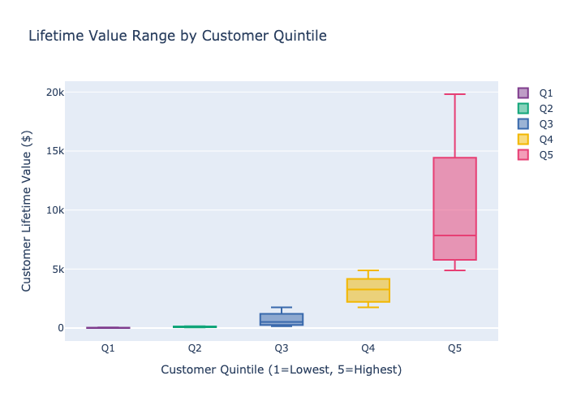

## Business Insights and Recommendations

Based on the analysis of customer lifetime value (LTV) data, here are key business insights and actionable recommendations:

### Insights:
High-Value Customers Drive Revenue (Quintile 5):

The top 20% of customers (Quintile 5) have an average LTV of $7,846.75, contributing significantly more than the bottom 80% combined (Quintiles 1-4 average $1,482 per customer).

Action: 
Prior Focus retention efforts on Quintile 5 customers with personalized offers, loyalty programs, or VIP perks to maintain their high spending (e.g., exclusive discounts or early access to new products).

Low LTV Customers (Quintile 1) Are Nearly One-Time Buyers:

Quintile 1 has an average of 1.05 orders and $23.95 LTV, indicating most are one-time or low-engagement buyers.

Action: 
Implement re-engagement campaigns (e.g., email follow-ups with discounts) to convert these customers into repeat buyers and move them to higher quintiles.

Order Frequency Increases LTV:

Quintile 5 averages 2.24 orders, while Quintiles 1-4 range from 1.05 to 1.5. The scatter plot (LTV vs Orders) shows a clear positive correlation.

Action: 
Encourage repeat purchases through bundling, subscription models, or incentives for frequent orders to boost LTV.

Annual LTV Disparity:

Quintile 5’s avg_annual_ltv ($3,590.55) is ~150x higher than Quintile 1’s ($24.08), highlighting a huge gap in yearly spending potential.

Action: 
Segment marketing budgets to prioritize high-LTV customers while testing low-cost strategies (e.g., automated emails) to uplift lower quintiles.

