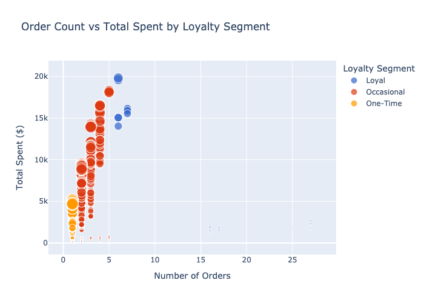
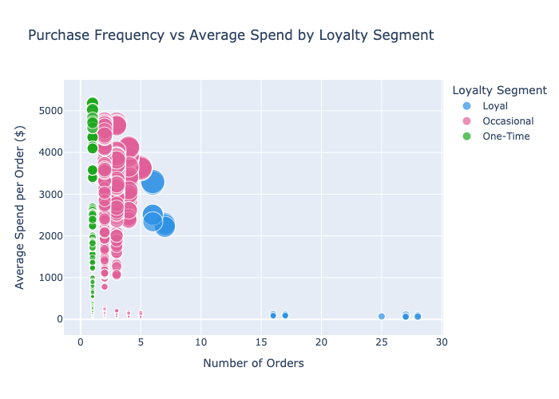
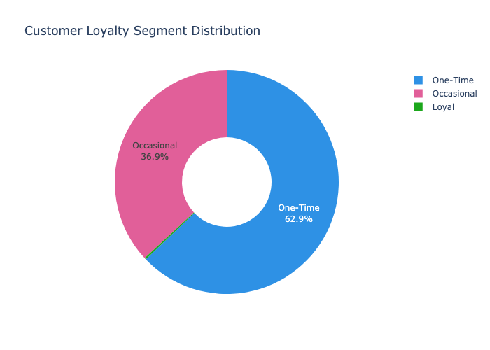
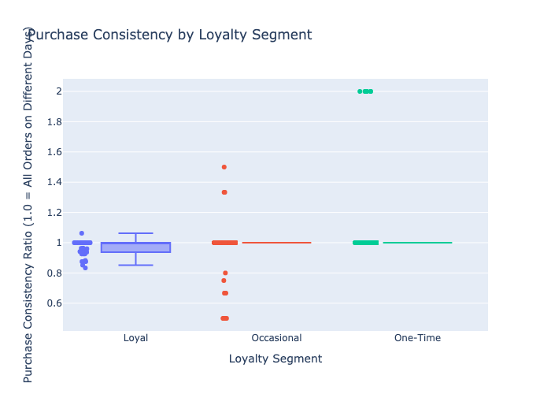

### Insights:
Loyal Customers Are Consistent and Valuable:

The sample shows “Loyal” customers (order_count > 5) with high total_spent ($1,632-$2,646) and frequent, consistent purchases (unique_purchase_days ≈ order_count).

Action: Reward these customers with exclusive benefits (e.g., free shipping, annual discounts) to maintain their loyalty and consistency.

High Spend per Order in Loyal Segment:

Avg_spend_per_order ranges from $60.44 to $98 among Loyal customers, suggesting they buy higher-value items or bundles.

Action: Offer premium products or upsell opportunities to Loyal customers to further increase their spend per order.

One-Time Buyers Dominate (Pie Chart Insight):

Assuming the pie chart shows a large “One-Time” segment (order_count = 1), these customers likely align with LTV Quintile 1 or 2.

Action: Use post-purchase surveys or incentives (e.g., “10% off your next order”) to understand their needs and encourage a second purchase.

Purchase Consistency Varies:

The box plot of purchase consistency (unique_purchase_days / order_count) could reveal Loyal customers nearing 1.0 (one purchase per day), while Occasional/One-Time buyers are lower.

Action: For Occasional buyers (order_count 2-5), introduce recurring purchase prompts (e.g., “Schedule your next order”) to boost consistency.

