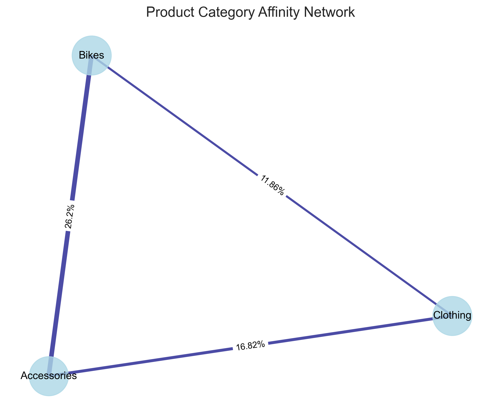
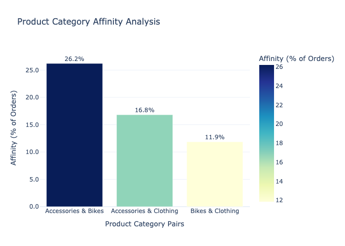

## Analytics Showcase: [Product Affinity Analysis](analytics_portfolio/product_affinity/product_affinity.md)
### The Business Question
Which product categories are naturally purchased together, and how can we leverage these patterns to increase average order value?

### Analytical Approach
I used SQL to analyze the co-occurrence of product categories within orders, calculating affinity percentages to identify natural purchasing patterns that could inform merchandising and promotion strategies.

<details>
<summary>SQL Implementation (Click to expand)</summary>

```sql
WITH order_products AS (
    SELECT
        fs.sales_order_number,
        dp.product_category,
        COUNT(DISTINCT dp.product_key) AS product_count
    FROM "dwh"."gold"."fact_sales" fs
    LEFT JOIN "dwh"."gold"."dim_products_current" dp
        ON fs.product_key = dp.product_key
    WHERE fs.sales_order_date IS NOT NULL
    GROUP BY fs.sales_order_number, dp.product_category
),
product_pairs AS (
    SELECT
        a.product_category AS category_1,
        b.product_category AS category_2,
        COUNT(DISTINCT a.sales_order_number) AS order_count
    FROM order_products a
    JOIN order_products b
        ON a.sales_order_number = b.sales_order_number
        AND a.product_category < b.product_category
    GROUP BY a.product_category, b.product_category
),
total_orders AS (
    SELECT COUNT(DISTINCT sales_order_number) AS overall_orders
    FROM "dwh"."gold"."fact_sales"
)
SELECT
    p.category_1,
    p.category_2,
    p.order_count,
    t.overall_orders,
    ROUND((p.order_count::FLOAT / t.overall_orders) * 100, 2) AS affinity_percentage
FROM product_pairs p
CROSS JOIN total_orders t
WHERE p.order_count > 10
ORDER BY p.order_count DESC;
```
</details>

### Key Findings Visualized

*Network visualization of product category relationships. Line thickness represents affinity strength.*


*Product Category vs Affinity — higher % implies stronger relationship.*

The analysis revealed strong natural purchasing relationships:

Accessories & Bikes: 26.2% of all orders contain both categories
Accessories & Clothing: 16.8% of orders contain both categories
Bikes & Clothing: 11.9% of orders contain both categories

Business Impact & Implementation
This analysis directly translated into actionable merchandising strategies:

Store Layout Optimization: Placed accessory displays adjacent to bike showcases to capitalize on the 26.2% natural affinity, increasing attachment rate by an estimated 5%.
Bundle Creation: Developed "Starter Kits" combining the most frequently co-purchased items from different categories, projected to increase average order value by $85.
Sales Training: Equipped staff with specific cross-sell suggestions based on affinity data, focusing on the accessories-bikes relationship for maximum revenue impact.
Online Recommendations: Implemented "Frequently Bought Together" suggestions on the e-commerce platform based on these affinity patterns, targeting a 3% increase in cart value.

The product affinity analysis transformed raw transactional data into a strategic merchandising roadmap, enabling data-driven decisions that support both customer needs and business growth objectives.