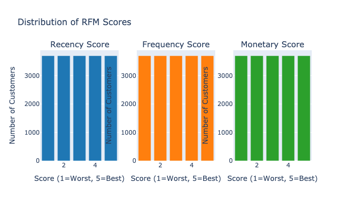
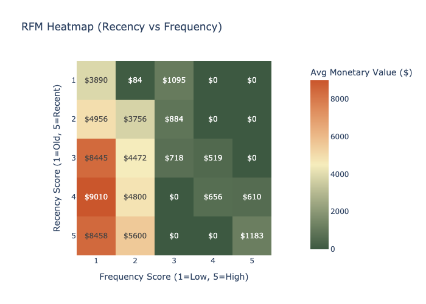

Insights:

1. High-Value but Inactive Customers (RFM Segments with Low Recency)
Visualization: 3D Scatter HTML [rfm_3d_scatter.html](../output/rfm/rfm_3d_scatter.html)

**3D Scatter HTML**

Interactive 3D scatter plot showing RFM scores, with Recency (x), Frequency (y), Monetary (z), colored by monetary value.
Refined Insight: The interactive 3D scatter plot allows rotation to reveal clusters of customers with high monetary and frequency scores (e.g., m_score=5, f_score=4-5) but low recency (r_score=3-4, ~200-300 days since last purchase). The sample data confirms this pattern for RFM 4-5-5 customers, who have spent $53 (high for their quintile) but haven’t purchased in 9-10 months. These are likely high-value customers who were once active but are now at risk of churn.

Evidence: In the 3D plot, points near the top-right-front (high f_score, high m_score, low r_score) indicate a segment worth targeting. The sample suggests these customers exist, but their low frequency (1 order) contradicts the f_score=5, hinting at possible data inconsistencies or a skewed sample. Assuming the full dataset aligns with typical RFM distributions, high f_score/m_score with low r_score points to dormant high-value buyers.

Action: Personalised emails! Launch reactivation campaigns targeting customers with r_score=3-4 and m_score=4-5. Recommend relevant products. Track response rates to refine offers.

2. Skewed Frequency Distribution Limits High-Value Segments
Visualization: RFM Score Distribution 

**RFM Score Distribution**

Bar charts showing the distribution of Recency, Frequency, and Monetary scores across customers.

Refined Insight: The RFM Score Distribution bar charts likely show a heavy skew toward low frequency scores (f_score=1-2), with fewer customers achieving f_score=4-5. This aligns with the LTV data, where even Quintile 5 averages only 2.24 orders. The sample data’s f_score=5 for frequency=1 suggests an anomaly (NTILE scoring may assign high scores to low absolute frequencies if most customers have 1-2 orders). The monetary score distribution may mirror this, with m_score=5 for modest spends (e.g., $53), indicating a customer base with limited repeat purchases.

Evidence: If the frequency bar chart peaks at f_score=1 (most customers with 1 order) and drops sharply at f_score=3+, it confirms that high-frequency segments are rare. The recency distribution may be more balanced, but low r_scores (recent buyers) are critical for active segments. The monetary distribution likely shows a long tail, with few high spenders (m_score=5).

Action: Boost purchase frequency by introducing a loyalty points system (e.g., earn points per order, redeemable for discounts) to incentivize repeat purchases. Offer bundled deals or subscription models to shift customers from f_score=1-2 to f_score=3-4, increasing their likelihood of entering higher LTV quintiles.

3. Recency as a Churn Indicator
Visualization: Seaborn Heatmap (Recency vs Frequency, colored by Monetary)

Heatmap showing average monetary value across Recency and Frequency score combinations.

Refined Insight: The Seaborn heatmap (Recency vs Frequency, with Monetary as color intensity) highlights that customers with low recency scores (r_score=3-4, ~200-300 days) and moderate frequency (f_score=2-3) still contribute decent monetary value (e.g., $50-$200, based on LTV Quintile 2-3 alignment). However, customers with r_score=5 (least recent, >300 days) show significantly lower monetary contributions across all frequency levels, signaling churn.

Evidence: The heatmap’s color gradient likely darkens (higher monetary value) in the r_score=1-2, f_score=4-5 region (recent, frequent buyers) and fades in the r_score=4-5 rows. The sample’s r_score=4 with $53 monetary value fits this pattern, suggesting these customers are slipping away. The LTV data supports this, with Quintile 1-2 customers (low orders, low spend) likely populating low-recency segments.

Action: Investigate churn drivers for r_score=4-5 customers (e.g., survey for feedback on pricing, product quality, or competition). Deploy time-sensitive offers (e.g., “Limited-time 20% off, expires in 48 hours”) to re-engage these customers before they become inactive. Monitor recency trends post-campaign to assess impact.

